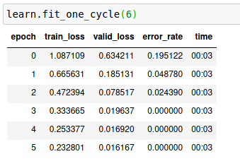
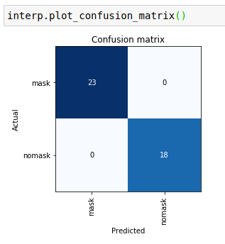
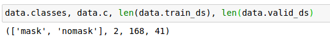

# Face Mask or No Face Mask

This model was trained with images of people wearing face masks (medical/ppe).  The question this model answers is "is the person in this photo wearing a face mask or not"?

This is the first CNN I've created.  It uses Pytorch and FastAI libraries.  Huge thanks to the tutorials at https://fast.ai.

## Run/Train

1. Install fastai, use [their docs](https://github.com/fastai/fastai/blob/master/README.md#installation) if you run into problems.

       conda install -c pytorch -c fastai fastai

1. Open and run each cell in the `mask-nomask.ipynd` Jupyter Notebook.

## Results

Here you can see the error rate got to zero

The confusion matrix looks great as well

And my data set of 168 images with a seeded random validation set of 41 images

## TO DO

- [ ] `train_loss` is higher than `valid_loss` yet `error_rate` got to zero....can we break the rule here of train loss being higher than valid loss?

- [ ] Find some images that are royalty free so that this is more reproducable.

- [ ] Provide a finished model that one can do inference with.